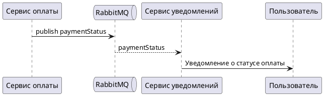

# Описание API

## Назначение API

API спроектировано на основе двух Use Case: **UC-4 (Бронирование парковочного места)** и **UC-5 (Выбор тарифного плана)**.

## Связанная схема

## Эндпоинты REST API

| Метод | Путь | Описание |
|---|---|---|
| `GET` | `/api/parking` | Получение списка доступных парковочных мест |
| `GET` | `/api/parking/{place_id}/tariffs` | Получение доступных тарифов по выбранному месту |
| `POST` | `/api/parking/reserve` | Бронирование парковочного места |

## Коды ошибок

| HTTP-код | Описание | Пример сообщения |
|---|---|---|
| `400` | Некорректный запрос | `"Ошибка при обработке запроса."` |
| `402` | Ошибка оплаты | `"Ошибка оплаты"` |
| `404` | Ресурс не найден | `"Не найдено тарифов для места"` |
| `500` | Внутренняя ошибка сервера | `"Ошибка сервера. Попробуйте позже."` |
| `503` | Сервис недоступен | `"Платёжная система недоступна"` |

## Асинхронное взаимодействие

### Схема взаимодействия

### AsyncAPI контракт

📖 **[Визуализация AsyncAPI](/docs/API-спецификация/asyncapi-reference)** — просмотрите структуру брокера, канала, операций и сообщения.

## OpenAPI 3.0 Спецификация

📖 **[Интерактивная документация API](/api-docs/)** — просмотрите полную спецификацию с примерами запросов и ответов.
