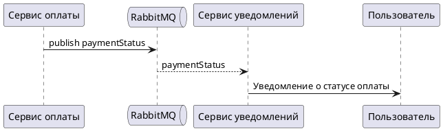

# AsyncAPI Спецификация

## Общая информация

| Поле | Значение |
|---|---|
| `asyncapi` | `3.1.0` |
| `title` | Бронирование парковочного места AsyncApi контракт |
| `version` | `1.0.0` |
| `defaultContentType` | `application/json` |

Контракт для публикации событий об изменении статуса оплаты бронирования парковочного места.

## Брокер сообщений

| Сервер | Host | Protocol | Описание |
|---|---|---|---|
| `rabbitmq` | `rabbitmq.example.com` | `amqp` | RabbitMQ брокер |

## Канал

| Channel | Address | Message |
|---|---|---|
| `change_status` | `change_status` | `paymentStatus` |

## Операции

| Операция | Action | Channel | Описание |
|---|---|---|---|
| `uploadPaymentStatus` | `send` | `change_status` | Сервис оплаты отправляет событие изменения статуса оплаты в RabbitMQ |
| `submitPaymentStatus` | `receive` | `change_status` | Сервис уведомлений получает событие из RabbitMQ и отправляет уведомление пользователю |

## Схема взаимодействия



## Сообщение `paymentStatus`

### Заголовки сообщения

| Поле | Тип | Формат | Описание |
|---|---|---|---|
| `messageId` | `string` | `uuid` | Уникальный идентификатор сообщения |

Пример:

```json
{
  "messageId": "550e8400-e29b-41d4-a716-446655440000"
}
```

### Payload `payment_change_status`

| Поле | Тип | Формат | Описание |
|---|---|---|---|
| `user_id` | `string` | `uuid` | Идентификатор пользователя |
| `reservation_id` | `string` | `uuid` | Идентификатор бронирования |
| `payment_id` | `string` | `uuid` | Идентификатор платежа |
| `operation_id` | `string` | `uuid` | Идентификатор события |
| `created_at` | `string` | `date-time` | Время создания события |
| `status` | `string` | - | Cтатус оплаты |

Обязательные поля:

- `user_id`
- `reservation_id`
- `payment_id`
- `operation_id`
- `created_at`
- `status`

Допустимые значения `status`:

- `PAID`
- `FAILED`
- `CANCELLED`
- `EXPIRED`

Пример:

```json
{
  "user_id": "550e8400-e29b-41d4-a716-446655440000",
  "reservation_id": "550e8400-e29b-41d4-a716-446655440000",
  "payment_id": "550e8400-e29b-41d4-a716-446655440000",
  "operation_id": "550e8400-e29b-41d4-a716-446655440000",
  "created_at": "2026-01-01T00:00:00Z",
  "status": "PAID"
}
```

## Исходный файл

Файл спецификации: `docs/API-спецификация/asyncapi.yaml`
