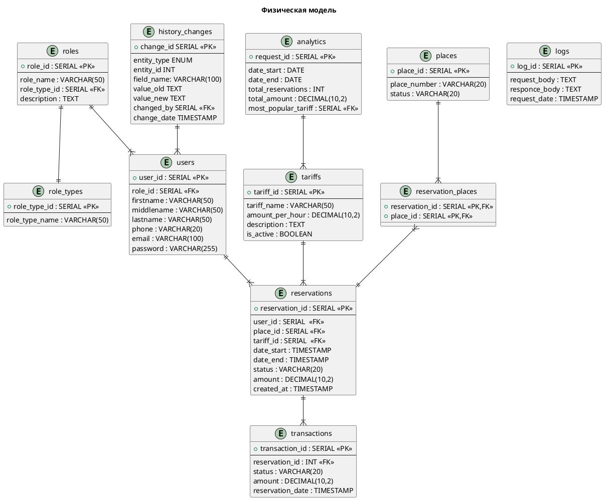

# Модели данных

## Концептуальная модель

### Основные связи
1. Один пользователь может иметь только одну роль, но одна роль может принадлежать множеству пользователей.
2. Один пользователь может оформить много броней парковочных мест.
3. Одна бронь может включать много парковочных мест, одно парковочное место может иметь множество бронирований.
4. Множество броней рассчитывается только по одному тарифу.
5. Одна бронь может включать множество платежей.
6. Во множестве отчётов может отражаться один тариф.
7. Один пользователь вносит множество изменений.

## Физическая модель

### Основные сущности

#### Пользователи (`users`)
| Атрибут | Тип | Описание |
|---|---|---|
| `user_id` | SERIAL PK | Идентификатор пользователя |
| `role_id` | SERIAL FK | Идентификатор роли |
| `email` | VARCHAR(100) | Электронная почта (уникальная) |
| `password` | VARCHAR(255) | Пароль (хешированный) |
*(Дополнительные поля: firstname, middlename, lastname, phone)*

#### Парковочные места (`places`)
| Атрибут | Тип | Описание |
|---|---|---|
| `place_id` | SERIAL PK | Идентификатор парковочного места |
| `place_number` | VARCHAR(20) | Номер парковочного места |
| `status` | VARCHAR(20) | Статус занятости |

#### Тарифные планы (`tariffs`)
| Атрибут | Тип | Описание |
|---|---|---|
| `tariff_id` | SERIAL PK | Идентификатор тарифа |
| `tariff_name` | VARCHAR(50) | Название тарифа |
| `amount_per_hour` | DECIMAL(10,2) | Стоимость в час |
| `is_active` | BOOLEAN | Статус активности тарифа |

#### Брони (`reservations`)
| Атрибут | Тип | Описание |
|---|---|---|
| `reservation_id` | SERIAL PK | Идентификатор брони |
| `user_id` | SERIAL FK | Идентификатор пользователя |
| `place_id` | SERIAL FK | Идентификатор парковочного места |
| `tariff_id` | SERIAL FK | Идентификатор тарифа |
| `date_start` / `date_end` | TIMESTAMP | Период бронирования |
| `status` | VARCHAR(20) | Статус брони |

#### Платежи (`transactions`)
| Атрибут | Тип | Описание |
|---|---|---|
| `transaction_id` | SERIAL PK | Идентификатор платежа |
| `reservation_id` | INT FK | Идентификатор брони |
| `status` | VARCHAR(20) | Статус платежа |
| `amount` | DECIMAL(10,2) | Стоимость платежа |

### Вспомогательные таблицы

Включают в себя `roles` (роли пользователей), `analytics` (аналитические отчёты), `logs` (логи запросов системы) и `history_changes` (история изменений сущностей).

## Диаграмма ER-модели

