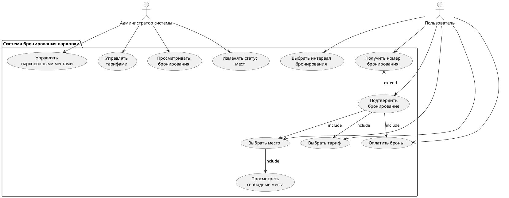
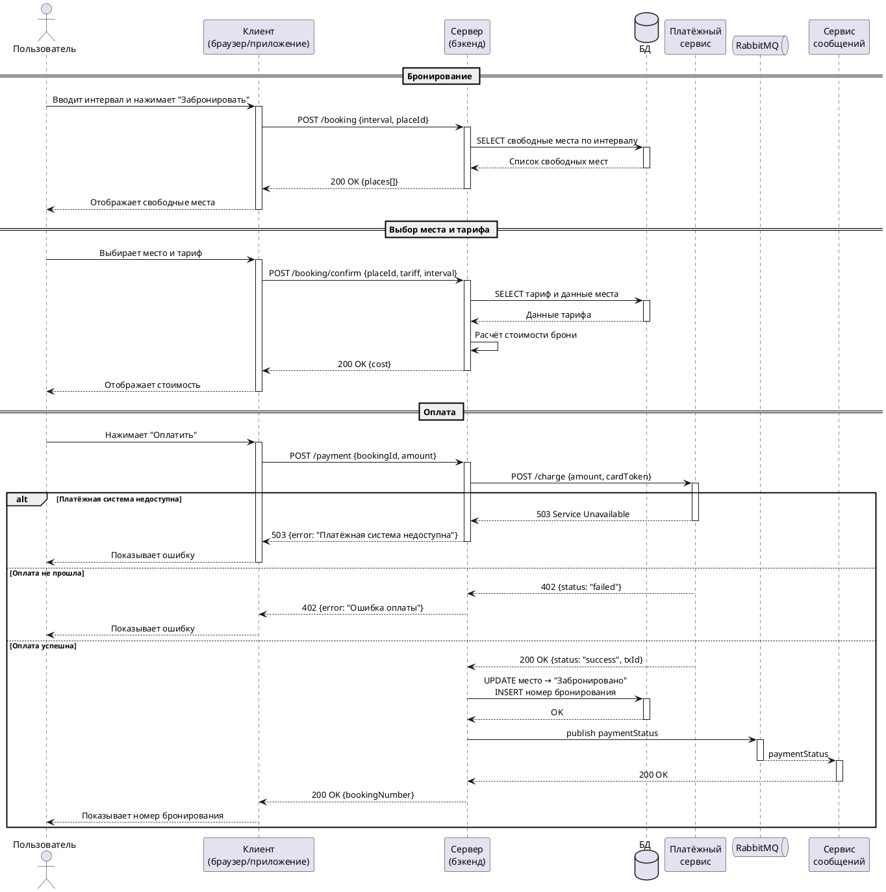

# Пользовательские сценарии и бизнес-логика

## Функциональные требования

| ID | Категория | Требование |
|---|---|---|
| FR-001 – 003 | Авторизация | Регистрация, авторизация и восстановление пароля |
| FR-004 – 006 | Бронирование | Отображение свободных мест, создание брони, предотвращение двойного бронирования |
| FR-007 – 008 | Тарификация | Отображение и выбор тарифов |
| FR-009 – 012 | Оплата | Оплата СБП, обработка статусов, формирование чека |
| FR-013 – 016 | Администрирование | Управление местами, тарифами и история бронирований |
| FR-017 – 018 | Уведомления | Уведомления об изменении статусов брони/оплаты |

## Бизнес-правила

| ID | Правило |
|---|---|
| BR-01 | Email уникален в системе |
| BR-02 | Одно место не может быть забронировано дважды на один и тот же временной интервал |
| BR-03 | При конкурентном бронировании выигрывает первый завершивший транзакцию |
| BR-04 | Тариф должен быть активен |
| BR-05 | Стоимость рассчитывается по формуле, закреплённой в тарифе |
| BR-06 | Один тариф может быть выбран только один раз для одной брони |
| BR-07 | Бронь не считается активной до успешной оплаты |
| BR-08 | Один платёж соответствует одной брони |

## Основные сценарии

### Диаграмма Use Cases

### Последовательность взаимодействия

### Ключевые Use Cases

#### UC-4: Бронирование парковочного места
**Предусловия:** Пользователь авторизован. В системе существуют парковочные места.
**Основной поток:**
1. Пользователь выбирает временной интервал.
2. Система отображает список доступных мест.
3. Пользователь выбирает конкретное место и тариф (UC-5).
4. Система проверяет доступность, фиксирует бронь и отображает подтверждение.
**Альтернативные потоки:** Нет доступных мест / Место уже занято.

#### UC-6: Оплата через СБП
**Предусловия:** Бронирование создано, находится в статусе «Ожидает оплаты».
**Основной поток:**
1. Пользователь нажимает «Оплатить».
2. Формируется платёжный запрос, переход на форму оплаты.
3. Платёжная система возвращает результат транзакции.
4. Система фиксирует статус, публикует событие изменения статуса оплаты и отправляет уведомление (UC-8).

#### UC-7: Администрирование системы
**Основной поток:** Авторизация администратора → управление местами (создание/блокировка), тарифами (редактирование/деактивация) и просмотр истории.

## Бизнес-процесс бронирования

**Основной поток BPMN:**
1. Запрос на бронирование → выбор интервала.
2. Проверка доступных вариантов через правила DMN (статусы тарифов).
3. **Шлюз:** Доступны ли варианты?
   - Нет → Отказ.
   - Да → Выбор места и тарифа.
4. Подтверждение бронирования и инициация оплаты.
5. Ожидание результата от платёжной системы.
6. **Шлюз:** Оплата проведена?
   - Нет → Отмена брони.
   - Да → Подтверждение в системе, публикация события в RabbitMQ и отправка уведомления клиенту.

